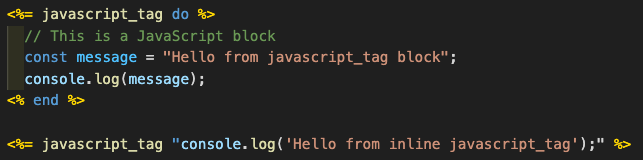

# ERB Inline JS Helper

Syntax highlighting for JavaScript embedded in Rails ERB `javascript_tag` blocks and inline strings.

## Features

- Highlights JavaScript inside `<% javascript_tag do %> ... <% end %>` blocks.
- Highlights JavaScript inside `<%= javascript_tag "..." %>` or `<%= javascript_tag '...' %>`.
- Works as an injection into `text.html.erb` grammar for ERB files.

## Installation

- Visual Studio Marketplace: https://marketplace.visualstudio.com/items?itemName=kudoas.erb-inline-js-helper
- Quick open in VS Code: `vscode:extension/kudoas.erb-inline-js-helper`

## Usage

Open any `.erb` file that uses `javascript_tag` and the JavaScript section will be highlighted automatically.

## Configuration

No settings are required.
